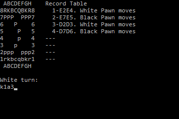

# Шахматы на языке Go

Данный репозиторий содержит реализацию игры шахматы в виде консольного приложения с текстовым интерфейсом. Игра доступна пока в режиме *"игрок против игрока"*. В дальнейшем планируется добавить режимы: *"игрок против компьютера"*, *"компьютер против компьютера"*. Игрок может делать ходы, вводя начальную и конечную координаты фигур, например: **"e2e4"**, **"g1f3"**. Если введен неправильный ход, будет выведена ошибка. Чтобы выйти из игры, введите **"q"**, **"quit"** или **"exit"**.



## Системные требования

**Операционная система:**

- Windows / MacOS / Linux.

**Программное обеспечение:**

- средства разработки языка Go >=v1.18;
- утилита make.

## Установка и запуск

Для **сборки** приложения **локально**, выполните команду в терминале:

```
make build
```

Для **запуска** приложения **локально**, выполните:

```
make run
```

Чтобы запустить приложение в режиме **быстрого запуска** (например, во время разработки), выполните команду:

```
make fast-run
```

Или выполните ее короткую версию:

```
make
```
